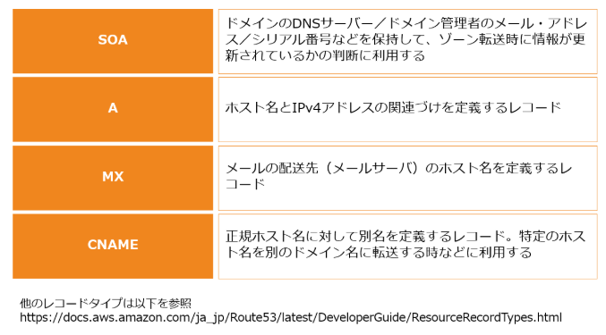
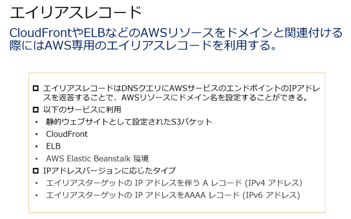
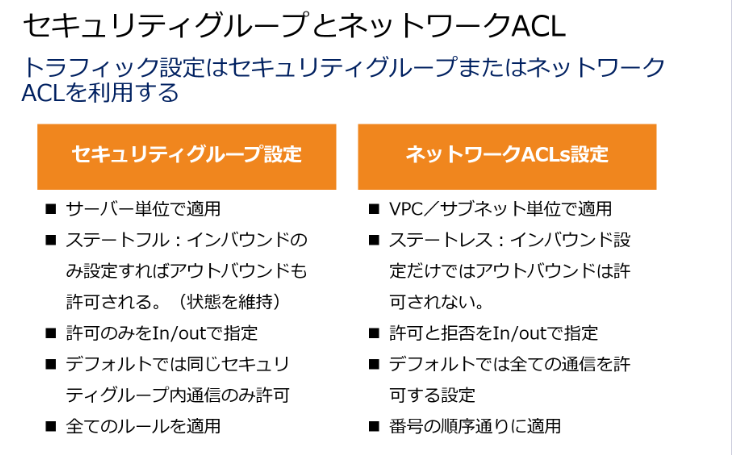
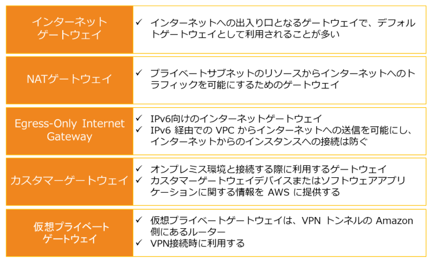
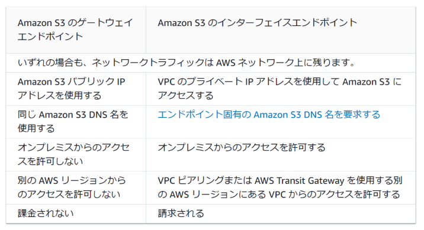

## Lambda
デフォルトタイムアウトは3秒
最大実行時間は15分
Lambdaレイヤーで共通機能を分離できる

### cloudformation: 
AWSリソースの作成や管理をコード化して行うIaC。環境の自動化・再利用性・変更管理に優れている。
これにより、必要なリソースを記述したテンプレート（JSONまたはYAML形式）を用いて、インフラセットアップが自動化。
テスト環境をさくっと用意できる。

- 宣言的な設定管理:
  - CloudFormationは、テンプレートに必要なリソースの状態を宣言し、その状態に自動的にクラウドリソースを設定
- 自動化と再現性:
  - 一度テンプレートを作成すれば、何度でも同じ環境を再現でき、環境のデプロイや削除も自動化
- 変更管理:
  - 既存の環境に対して変更点をテンプレート上で管理し、差分適用が容易です。
- 類似機能との比較
  - AWS CLIやSDK:
手動またはスクリプトでリソースを設定します。柔軟性は高まるが、複数リソースの一括管理や再現性は劣る。
  - Terraform（他クラウドも対応のIaCツール）:  
複数クラウドに対応し、同一のコードでAWS以外のインフラも管理可能。CloudFormationはAWS専用
#### オプション
変更セット：スタックの変更が実行中のリソースに及ぼす可能性のある影響を把握する
ドリフト検出：テンプレートと実際に展開されたインフラストラクチャとの間に生じる差異をみる
outputs セクション：別テンプレートへ、Export 属性を用いてエクスポートする値を指定
### DB
- 自己管理したい場合
-> EC2をたててDB構築
- マネージド
-> RDS, DynamoDB, Aurora

### オンプレとの接続
> あなたはソリューションアーキテクトとして自社環境のAWSへの移行を検討しています。現在、オンプレミス環境であるデータセンターに大量のデータを保持しており、その環境は今後も利用される予定です。よってAWSへと50 Mbpsによる高可用な専用線接続が必要となります。
プライベート接続でよいので、*AWS Direct Connect*が適任。帯域幅のスループットが上がり安定。
インターネット接続がよい場合
→VPCピアリング、VPN、インターネットゲートウェイ

## Aurora
Auroraのクロスリージョンレプリカ機能：Auroraレプリカを別リージョンに展開する
Aurora DBクラスター：単一の AWS リージョン内で複数の AZ にまたがる DB クラスターが構成される。プライマリが失敗しても、既存レプリカがプライマリに昇格するor新プライマリインスタンス作成
※「Mysqldumpユーティリティ」=> 不正解。AWSリソースに依存しないため。

レプリカ作成するとプライマリ復旧は1分単位に。
### Aurora Global Database
リージョンを横断して高速なクラスター構成に。
## EC2
リザーブドインスタンスの徳
購入したリザーブドインスタンスの台数に基づいて、一括請求グループの全アカウントに適用される。
※各アカウントのインスタンスが、同じゾーン・同じインスタンスタイプ。ｊｊ
※クロスアカウント設定は、別アカウントのリソース同士をつなげるものなので無関係。（S3からS3に持っていく、みたいなやつ）

## S3
#### タイプ

Infrequency Access：低頻度アクセス
#### ホスティング
S3の性的ホスティング機能を使って、簡単なWEBページを見せることができる。EC2より簡単。
ただしHTTTPSが使用できない（※CloudFrontと連携すると可能）
通知サービスがあり、ファイルが保存されたことをトリガーにLambda関数をよんだり。  
#### セキュリティ
オブジェクトの所有者はアップロードしたアカウントであり、バケット所有者ではない。
オブジェクト所有者がアクセス権を付与する場合、オブジェクトのACL（アクセスコントロールリスト）を更新する。

https://qiita.com/c60evaporator/items/da47620d69f84a9be7dc

#### 権限
オブジェクトロックのコンプライアンスモード：
指定した保持期間中にS3バケット内のオブジェクトに対してデータ変更や削除ができなくなる。保持期間は変更できない。
WORM（write once read many）
コンプライアンスモード　＞　ガバナンスモード

※クロスアカウントアクセス：別アカウントのIAMユーザーからアクセス可能に。

#### パフォーマンス
日時のプレフィックスをつけることでパフォーマンスが上がる。put 3500req/s, 取得で5500req/s.

#### ライフサイクル
S3内でライフサイクルを設定し、一定時間後に‘Glacierへの移行も可能。
EFSはEFS内でしかライフサイクル設定できない（削除できずアーカイブだけ）。EBSはスナップショット機能はあるが、ライフサイクルで移行はできない。

#### タイプ
standard：アクセス効率がいい
RRS：重い。冗長性能が最も低い

#### ストレージクラス分析
ストレージタイプを変えたいがいつ変えよう。。
フィルタリングされたデータセットのアクセスパターンを一定期間にわたり監視する

#### 更新時
強い整合性があるため、更新と呼び出しなどが僅差になっても誤差は発生しない。
2021年ころまでは結果整合性をとっていたため、誤差が発生する可能性があった  

### 権限
事前署名付きURL発行ができる。特定のバケットにアップロードさせたいが、認証情報はあげたくないときに使う。
デフォルト：全オブジェクトがプライベート。

## Amazon Athena
S3内で簡単にクエリ実行できる。
1. クエリエディタを作成し、クエリ結果の保存先を設定
2. クエリを実行するための環境としてテーブルを作成。
## Amazon OpenSearch Service
フレーズ検索ができる。 RDS,S3と連携するとDB検索も可能
## DynamoDB

#### 用途
JSON形式のデータを保存処理できる。セッションデータの処理に向いている
自動的に３つのAZに保存される。初めからマルチAZ

Amazon DynamoDB Accelrator（DAX）：キャッシュレイヤー追加で高速化
DynamoDBストリーム：リアルタイムに他アプリとトランザクションデータを共有。履歴を見れる

#### モード
- オンデマンドモード：トラフィック量が予測できないときにスケーリング。実働課金
- プロビジョニング：事前予測できる場合。設定に応じて課金
- ※グローバルテーブル：別リージョンにレプリケート。冗長化UP

#### 前処理
DynamoDBトランザクション機能：データを書き込む際に機密性の高いデータを削除したり。

#### 復旧
ポイントインタイムリカバリ機能:指定したタイミングのテーブルを復旧できる。上限35日間。
## Route 53
通常はDNSレコード。
Aliasレコード：DNS機能に対する拡張機能を提供
位置情報ルーティング設定で、地理的位置に基づいてトラフィック調整できる。　※ELBにこれはできない
https://dev.classmethod.jp/articles/dns-record-type-for-aws/

- Aレコード（ホストレコード）
ドメイン名に対してIPアドレスを直接紐づけるレコード。cloudfrontはIP固定じゃないので使用できない

- CNAMEレコード
CloudFrontのドメイン名（CNAME）をルートドメインに設定できない。サブドメインならOK
例：www.example.com => NG
    example.com => OK

### マルチバリュールーティング
IPアドレスごとに正常・非正常を判断し、適切なルーティングを行う
## CloudFront
オリジンサーバー1つから世界中のエッジロケーションにあるサーバに配布して配信できる。
オリジンは一つのリージョンで大丈夫。
※自動的にAWS ShieldのStandard版が適用！
### テンプレート設定
ポート番号は？
Egress：アウトバウンドならtrue, インバウンドならfalse
IPアドレスは？

### 権限
CloudFrontにいずれかを割り当て、S3側で許可する。IAMではないので注意
オリジンアクセスコントロール (OAC)（新しいほう）
オリジンアクセスアイデンティティ（OAI）

### コストの話
各エッジで圧縮処理できる。配布・連携が軽くなるのでコスト最適化に。

### フィールドレベル暗号化
アップロード時の暗号化、アクセス対象の限定ができる。
アップロード時は最寄りのエッジで暗号化し、アクセス時に鍵を持っているアプリだけ複合できる

## SQS
### ReceiveMessage API
すべてのコンシューマーがメッセージの取得を待つ。
### ChangeMessageVisibility API
タイムアウト値を設定して、ほかのコンシューマーにも二重取得されるのを防ぐ。
コンシューマー一人が受診している間はほかのコンシューマーにとられないようにする。
### デッドレターキュー
実行に失敗したメッセージをAmazon SQSのキューに蓄積する
## SNS
単位：トピック
フィルターポリシーJSONを設定してメッセージ発行し、一致したら設定された受信者に送信。

## EBS
IOPS性能とボリュームサイズ（GiB単位）の最大比率は50：1
例：100 GiBのボリュームは最大で5,000 IOPSのプロビジョニングが可能

#### DeleteOnTermination
EC2停止時にEBSも一緒に削除されるかどうか。デフォルトは有効。
## EFS
ブロックできる！複数のインスタンスから同時にアクセスできる。
アクセスセマンティクス：強い整合性、ファイルのロック
比較
S3：同時アクセスできるが、ファイルロックできない
EBS:単一インスタンスから低いレイテンシーで問題ないとき
Glacier：長期保存用。高頻度には利用できない

ライフサイクル管理によってファイルが IA ストレージクラスに移動されると、無期限にデータが残る。削除しない。
# データ分析計
### EMS
ログファイルの解析や機械学習など。Elastic Map Resource

## API Gateway
HTTPリクエスト：Lambdaファンクションと連携することで、サーバーレスアプリケーションでHTTPリクエストを受け取れる

# セキュリティ系
### ポート番号
80:http
20:ftp
22:ssh

## RedShift
フルマネージド型のデータウェアハウス
### 配置箇所・接続
特定VPCの特定のAZに配置される。
VPC外のAmazon S3バケットにアクセスする際は、インターネットを経由するか、VPCエンドポイントが必要。

### Amazon Redshift Spectrum
バケットにあるファイルに対し、直接クエリ処理。
数銭台のインスタンスにスケール可能。つよい

VPC ルーティング設定すると：
クラスターとデータリポジトリ間のすべての COPY と UNLOAD トラフィックが Amazon VPC を経由。
->監視もできるように。

## AWS Parallel Cluster
HPUコンピューティング環境の構築・デプロイ。自動スケールするクラスタを構築してくれる
たくさんの高性能計算環境をまとめて使える！リソースやスケジューラも自動設定！

https://qiita.com/haruki2000/items/cdb16eb407662f4ff810
### EFA (Elastic Fablic Adapter)
複数台のコンピュータをまとめて高速化。かつコスト最適化

## kinesis
ストリームデータの処理。
Data Streamsでストリームデータをリアルタイム取得・処理。
### Amazon Kinesis Data Firehose
ストリームデータを変換し、ストレージ・DBに配信。S3などに送信できる。

## Shield
- Shield Standard:無料。コストが比例する
- AWS Shield Advanced:有料。DDOS攻撃が激化してもコスト最適化。
  ELBをオリジンにしてCloudFront設定すると、自動的に適用される

## GuardDuty
DDoS攻撃以外を防ぐ

## EventBridge
システムイベント発生時に自動実行されるワークフロー。
LambdaやCloudWatch設定は不要！

## ネットワークACL（アクセスコントロールリスト）
ネットワークACLはステートレスであるため、インバウンド通信を許可するだけでなく、アウトバウンド通信の許可設定も求められます。この場合、PC側では多くのポート番号の設定が必要となり、エフェメラルポートを使用したSSH通信の設定が求められます。具体的には、1024から65535のポート番号範囲でSSHを許可する必要があります。これにより、PC側で設定されたポート番号が1024から65535の範囲内であれば、ネットワークACLによって戻りトラフィックが許可されることになります。

- [ ]  EC2インスタンスはパブリックIPアドレスまたはElastic IPアドレスが付与されている。
これをパブリックインターネットへのアクセスに利用できる。

- [ ]  セキュリティグループにはSSHのインバウンドアクセスが許可されている。
セキュリティグループはステートフルであるため、SSHのインバウンドアクセスが許可されていればアウトバウンドの許可は必要はありません。

- [ ]  サブネットのネットワークACLにはSSHのインバウンドアクセスに加えて、アウトバウンド通信設定にエファメルポートへのアウトバウンド通信の許可ルールを設定する。
ネットワークACLはステートレスであるため、アウトバウンド通信の許可設定も必要となります。その場合は、PC側の広範囲なポート番号が必要となるため、エフェメラルポートの設定が必要となります。これは1024-65535のポート番号範囲でSSHを許可する設定です。これによって、PC側で1024-65535のポート番号範囲のいづれかが設定されたとしても、ネットワークACLによって戻りトラフィックが許可されることになります。

- [ ]  パブリックサブネットにはインターネットゲートウェイへのルートが設定されている。
パブリックサブネットはインターネットへの通信が可能となります。

https://docs.aws.amazon.com/ja_jp/vpc/latest/userguide/vpc-network-acls.html
※ルールはルールNOの早い順に適用。上に書いたものが優先される

## Apprication Load Balancer
#### メトリクス
・ASGAverageCPUUtilization – Auto Scaling グループの平均 CPU 使用率。
・ASGAverageNetworkIn – すべてのネットワークインターフェイスで Auto Scaling グループが受信した平均バイト数。
・ASGAverageNetworkOut – すべてのネットワークインターフェイスで Auto Scaling グループが送信した平均バイト数。
・ALBRequestCountPerTarget – Application Load Balancer ターゲットグループ内のターゲットごとに完了したリクエストの数。

## エンドポイント
### ゲートウェイエンドポイント：
AWSネットワークを通じてVPCからAmazon S3にアクセスするために、VPCのルートテーブルにルートを設定する必要があるゲートウェイです。
VPCがインターネットゲートウェイやNATデバイスを介さずに、Amazon S3およびDynamoDBへの信頼性の高い接続を提供します。S3やDynamoDBに接続したいリソースが存在するVPCにVPCエンドポイントを割り当て、ルートテーブルにそのルーティングを設定します。

### インターフェースエンドポイント：

# 環境移管系
### ROA（ルートオリジン認証）
BGP（ボーダーゲートウェイプロトコル）で使用されるAS（自律システム）番号とIPアドレスの組み合わせが正当であることを示す電子署名付きのデータ
パブリックなIPv4またはIPv6アドレス範囲の一部または全体を、オンプレからAWSアカウントに移行

### シングルサインオン
AWS IAM Identity Centerで、オンプレミス環境のActive Directoryと連携して、SAMLフェデレーションする。
※SAML（Security Assertion Markup Language）というプロトコルを基盤で、一度ログインするだけで、複数のサービスにアクセスできるようになる
※SAML：XML形式のセキュリティ面に使用されるプロトコル？

## AWS DataSync
ストレージ系の移行作業はこれ。オンプレ側にインストールする