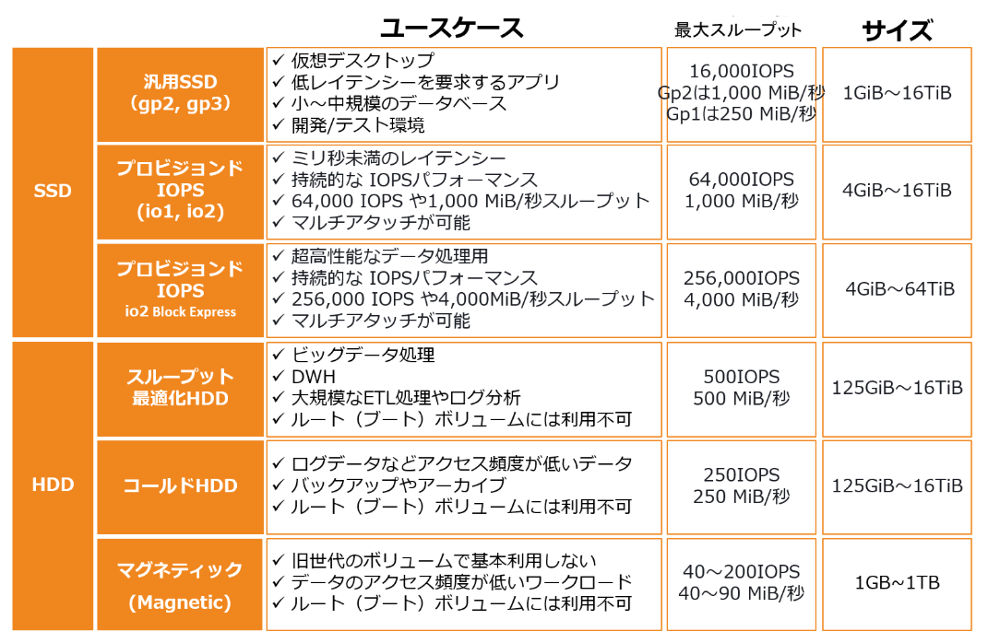
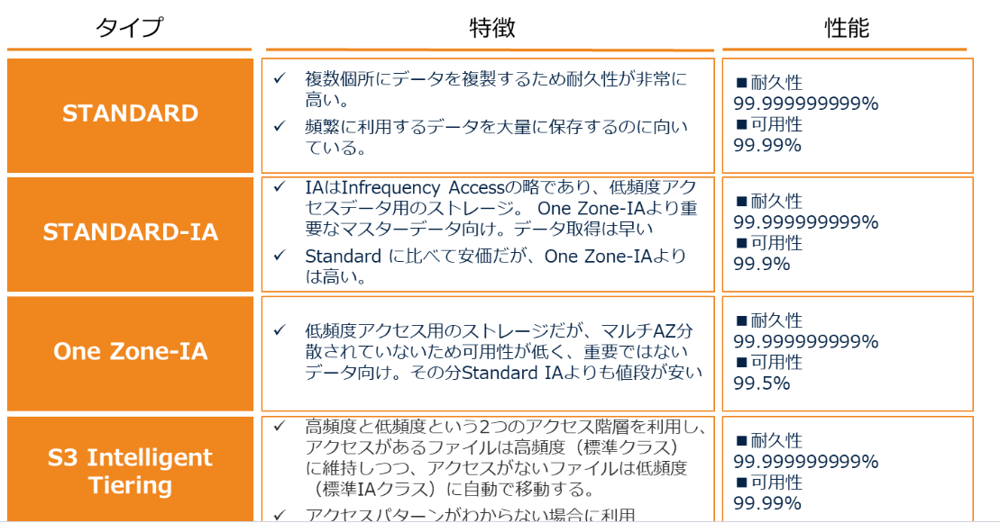
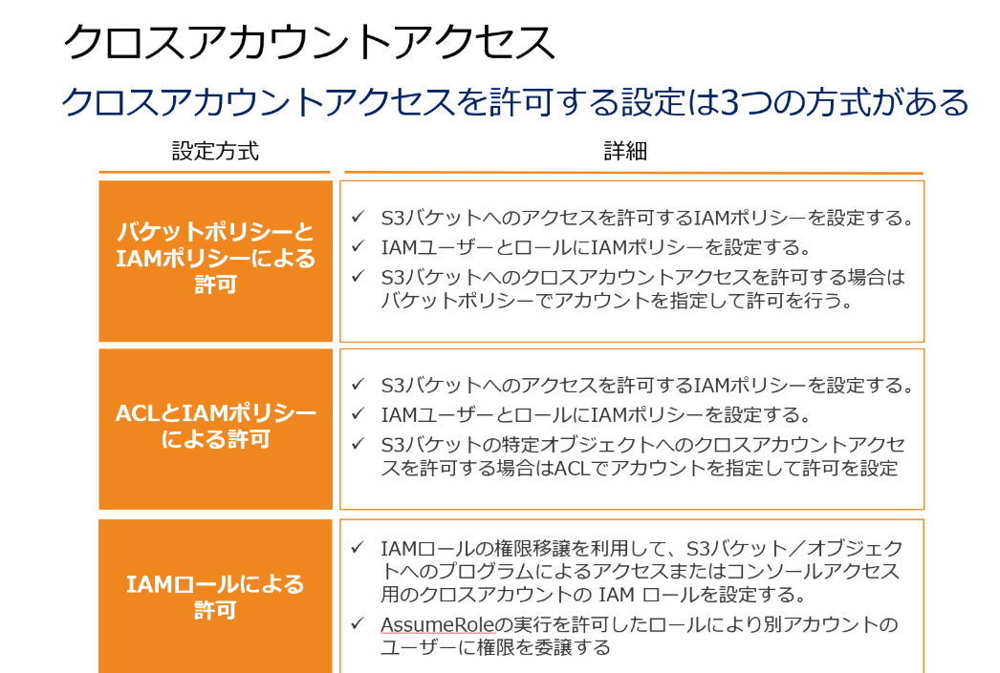

# q.2
### cloudformation: 
AWSリソースの作成や管理をコード化して行うIaC。環境の自動化・再利用性・変更管理に優れている。
これにより、必要なリソースを記述したテンプレート（JSONまたはYAML形式）を用いて、インフラセットアップが自動化。
テスト環境をさくっと用意できる。

- 宣言的な設定管理:
  - CloudFormationは、テンプレートに必要なリソースの状態を宣言し、その状態に自動的にクラウドリソースを設定
- 自動化と再現性:
  - 一度テンプレートを作成すれば、何度でも同じ環境を再現でき、環境のデプロイや削除も自動化
- 変更管理:
  - 既存の環境に対して変更点をテンプレート上で管理し、差分適用が容易です。
- 類似機能との比較
  - AWS CLIやSDK:
手動またはスクリプトでリソースを設定します。柔軟性は高まるが、複数リソースの一括管理や再現性は劣る。
  - Terraform（他クラウドも対応のIaCツール）:  
複数クラウドに対応し、同一のコードでAWS以外のインフラも管理可能。CloudFormationはAWS専用

# q.3
### DB
- 自己管理したい場合
-> EC2をたててDB構築
- マネージド
-> RDS, DynamoDB, Aurora

# q.4
### オンプレとの接続
> あなたはソリューションアーキテクトとして自社環境のAWSへの移行を検討しています。現在、オンプレミス環境であるデータセンターに大量のデータを保持しており、その環境は今後も利用される予定です。よってAWSへと50 Mbpsによる高可用な専用線接続が必要となります。
プライベート接続でよいので、*AWS Direct Connect*が適任。帯域幅のスループットが上がり安定。
インターネット接続がよい場合
→VPCピアリング、VPN、インターネットゲートウェイ

## EC2
リザーブドインスタンスの徳
購入したリザーブドインスタンスの台数に基づいて、一括請求グループの全アカウントに適用される。
※各アカウントのインスタンスが、同じゾーン・同じインスタンスタイプ。ｊｊ
※クロスアカウント設定は、別アカウントのリソース同士をつなげるものなので無関係。（S3からS3に持っていく、みたいなやつ）

## S3
#### タイプ

Infrequency Access：低頻度アクセス
#### ホスティング
S3の性的ホスティング機能を使って、簡単なWEBページを見せることができる。EC2より簡単。
ただしHTTTPSが使用できない（※CloudFrontと連携すると可能）
通知サービスがあり、ファイルが保存されたことをトリガーにLambda関数をよんだり。  
#### セキュリティ
オブジェクトの所有者はアップロードしたアカウントであり、バケット所有者ではない。
オブジェクト所有者がアクセス権を付与する場合、オブジェクトのACL（アクセスコントロールリスト）を更新する。

https://qiita.com/c60evaporator/items/da47620d69f84a9be7dc

#### 権限
オブジェクトロックのコンプライアンスモード：
指定した保持期間中にS3バケット内のオブジェクトに対してデータ変更や削除ができなくなる。保持期間は変更できない。
WORM（write once read many）
コンプライアンスモード　＞　ガバナンスモード

※クロスアカウントアクセス：別アカウントのIAMユーザーからアクセス可能に。

#### パフォーマンス
日時のプレフィックスをつけることでパフォーマンスが上がる。put 3500req/s, 取得で5500req/s.

#### ライフサイクル
S3内でライフサイクルを設定し、一定時間後に‘Glacierへの移行も可能。
EFSはEFS内でしかライフサイクル設定できない（削除できずアーカイブだけ）。EBSはスナップショット機能はあるが、ライフサイクルで移行はできない。

#### タイプ
standard：アクセス効率がいい
RRS：重い。冗長性能が最も低い

#### 更新時
強い整合性があるため、更新と呼び出しなどが僅差になっても誤差は発生しない。
2021年ころまでは結果整合性をとっていたため、誤差が発生する可能性があった  

### 権限
事前署名付きURL発行ができる。特定のバケットにアップロードさせたいが、認証情報はあげたくないときに使う。
デフォルト：全オブジェクトがプライベート。

## DynamoDB

#### 用途
JSON形式のデータを保存処理できる。セッションデータの処理に向いている
自動的に３つのAZに保存される。初めからマルチAZ

Amazon DynamoDB Accelrator（DAX）：キャッシュレイヤー追加で高速化
## Route 53
通常はDNSレコード。
Aliasレコード：DNS機能に対する拡張機能を提供
位置情報ルーティング設定で、地理的位置に基づいてトラフィック調整できる。　※ELBにこれはできない
https://dev.classmethod.jp/articles/dns-record-type-for-aws/

- Aレコード（ホストレコード）
ドメイン名に対してIPアドレスを直接紐づけるレコード。cloudfrontはIP固定じゃないので使用できない

- CNAMEレコード
CloudFrontのドメイン名（CNAME）をルートドメインに設定できない。サブドメインならOK
例：www.example.com => NG
    example.com => OK
## CloudFront
オリジンサーバー1つから世界中のエッジロケーションにあるサーバに配布して配信できる。
オリジンは一つのリージョンで大丈夫。

### テンプレート設定
ポート番号は？
Egress：アウトバウンドならtrue, インバウンドならfalse
IPアドレスは？

### コストの話
各エッジで圧縮処理できる。配布・連携が軽くなるのでコスト最適化に。

### フィールドレベル暗号化
アップロード時の暗号化、アクセス対象の限定ができる。
アップロード時は最寄りのエッジで暗号化し、アクセス時に鍵を持っているアプリだけ複合できる

## EFS
ブロックできる！複数のインスタンスから同時にアクセスできる。
アクセスセマンティクス：強い整合性、ファイルのロック
比較
S3：同時アクセスできるが、ファイルロックできない
EBS:単一インスタンスから低いレイテンシーで問題ないとき
Glacier：長期保存用。高頻度には利用できない

ライフサイクル管理によってファイルが IA ストレージクラスに移動されると、無期限にデータが残る。削除しない。
# データ分析計
### EMS
ログファイルの解析や機械学習など。Elastic Map Resource

# セキュリティ系
### ポート番号
80:http
20:ftp
22:ssh

## RedShift
フルマネージド型のデータウェアハウス
### 配置箇所・接続
特定VPCの特定のAZに配置される。
VPC外のAmazon S3バケットにアクセスする際は、インターネットを経由するか、VPCエンドポイントが必要。

VPC ルーティング設定すると：
クラスターとデータリポジトリ間のすべての COPY と UNLOAD トラフィックが Amazon VPC を経由。